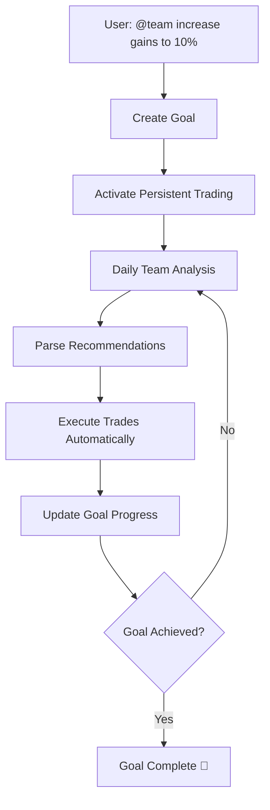
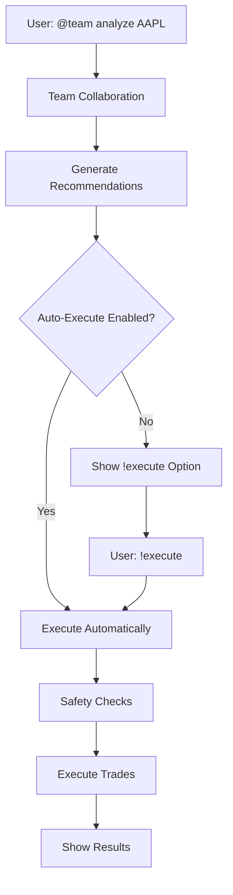

# 🚀 Automatic Trade Execution System

A revolutionary enhancement to the CrewAI Trading System that **automatically executes** trading recommendations from the AI team collaboration. No more manual trade execution - the system now transforms recommendations into actual trades!

## 🎯 What's New

### **The Problem Before**
- Team provides excellent trading recommendations
- User has to manually execute each trade
- Recommendations like "reduce AAPL allocation from 40% to 0%" required manual calculation and execution
- Goal-oriented trading still required manual intervention

### **The Solution Now**
- **Automatic Parsing**: Extracts trading actions from team recommendations
- **Automatic Execution**: Executes trades through your broker API
- **Safety First**: Comprehensive safety checks and risk management
- **Goal Integration**: Automatically executes trades to achieve your goals
- **Real-time Tracking**: Monitors execution results and updates progress

## 🔧 How It Works

### 1. **Recommendation Parsing**
The system intelligently parses various recommendation formats:

```text
"Reduce AAPL allocation from 40.0% to 0.0%"
→ SELL AAPL (calculated shares based on portfolio)

"BUY NVDA 100 shares for AI exposure"
→ BUY NVDA 100 shares

"Increase MSFT allocation from 30.0% to 72.7%"
→ BUY MSFT (calculated shares for rebalancing)
```

### 2. **Safety Checks**
Before execution, every trade goes through:
- Position size validation
- Risk percentage checks
- Market condition assessment
- Broker API connectivity verification
- Available capital confirmation

### 3. **Execution**
Trades are executed through your configured broker:
- **StocksTrader API**: Full-featured trading platform
- **Alpaca API**: Commission-free trading with paper trading support
- **Demo Mode**: Safe simulation for testing

### 4. **Progress Tracking**
Results are automatically tracked:
- Goal progress updates
- Trade execution logs
- P&L calculations
- Portfolio impact assessment

## 🎮 Usage Examples

### **Goal-Oriented Trading (Automatic)**
```bash
You: "@team increase portfolio gains to 10%"

System: 
1. Creates goal and activates persistent trading
2. Team analyzes market and provides recommendations
3. System automatically executes trades
4. Continues daily until 10% gain achieved
```

### **Regular Trading with Auto-Execute**
```bash
You: "!auto-execute"  # Enable automatic execution
You: "@team analyze AAPL and create trading strategy"

System:
1. Team provides comprehensive analysis
2. System automatically executes recommended trades
3. Shows execution results immediately
```

### **Manual Execution**
```bash
You: "@team analyze TSLA"
System: [Shows team recommendations]

You: "!execute"  # Execute last recommendations
System: [Executes trades with confirmation]
```

## 💬 New Chat Commands

| Command | Description |
|---------|-------------|
| `!execute` | Execute last team recommendations |
| `!auto-execute` | Toggle automatic trade execution |
| `!goals` | Show active trading goals |
| `!progress` | View goal progress reports |
| `!stop-goal <id>` | Stop trading for specific goal |

## ⚙️ Configuration

### Environment Variables
```bash
# Automatic execution
AUTO_EXECUTE_TRADES=true          # Enable auto-execution for regular trading
ENABLE_LIVE_TRADING=true          # Enable real money trading
PRIMARY_BROKER=alpaca             # Choose broker (alpaca/stockstrader)

# Safety settings
MAX_POSITION_SIZE=1000            # Maximum shares per trade
MAX_RISK_PERCENT=2.0              # Maximum risk per trade (%)

# Broker configuration
ALPACA_API_KEY=your_key
ALPACA_SECRET_KEY=your_secret
ALPACA_BASE_URL=https://paper-api.alpaca.markets
```

## 🔄 Trading Flow

### **Goal-Oriented Trading**


### **Regular Trading**


## 📊 Execution Results

### **Successful Execution**
```text
⚡ **AUTOMATIC EXECUTION RESULTS:**

✅ **EXECUTED TRADES (3):**
   • SELL AAPL: 150.00 shares @ $180.50
     Value: $27,075.00 | Reason: Portfolio rebalancing: 40.0% → 0.0%
   • BUY MSFT: 200.00 shares @ $350.25
     Value: $70,050.00 | Reason: Portfolio rebalancing: 30.0% → 72.7%
   • BUY NVDA: 100.00 shares @ $875.00
     Value: $87,500.00 | Reason: Direct recommendation: BUY NVDA

📊 **EXECUTION SUMMARY:**
   • Total Trades: 3
   • Successful: 3
   • Failed: 0
   • Total Value: $184,625.00
```

### **Safety Block Example**
```text
⚡ **AUTOMATIC EXECUTION RESULTS:**

❌ **FAILED TRADES (1):**
   • BUY AAPL: Position size 10000 exceeds maximum allowed 1000 shares

📊 **EXECUTION SUMMARY:**
   • Total Trades: 1
   • Successful: 0
   • Failed: 1
   • Safety Protection: ACTIVE
```

## 🛡️ Safety Features

### **Multi-Layer Protection**
1. **Position Size Limits**: Maximum shares per trade
2. **Risk Percentage**: Maximum risk per trade
3. **Portfolio Percentage**: Maximum % of portfolio per position
4. **Market Conditions**: Bid-ask spread validation
5. **Broker Validation**: API connectivity checks
6. **Simulation Mode**: Safe testing environment

### **Risk Management**
- **Stop Loss**: Automatic stop loss calculation
- **Take Profit**: Risk-reward ratio optimization
- **Position Sizing**: Kelly criterion and volatility-based sizing
- **Diversification**: Correlation risk assessment

## 🎯 Goal Types Supported

| Goal Type | Description | Example |
|-----------|-------------|---------|
| Portfolio Gains | Increase overall portfolio % | "increase gains to 10%" |
| Daily Profit | Daily profit targets | "make $500 daily profit" |
| Portfolio Value | Target portfolio value | "reach $100,000 portfolio" |
| Risk Reduction | Reduce portfolio risk | "reduce risk to 15%" |
| Sharpe Ratio | Improve risk-adjusted returns | "achieve 1.5 Sharpe ratio" |

## 🚀 Quick Start

### 1. **Basic Setup**
```bash
# Clone and install
git clone <repository>
cd crewai-stock-trader-agents-main
pip install -r requirements.txt

# Configure environment
cp exemple_env_template.txt .env
# Edit .env with your settings
```

### 2. **Enable Automatic Execution**
```bash
# Add to .env
AUTO_EXECUTE_TRADES=true
ENABLE_LIVE_TRADING=true  # For real trading
PRIMARY_BROKER=alpaca

# For paper trading (safe)
ALPACA_BASE_URL=https://paper-api.alpaca.markets
```

### 3. **Start Trading**
```bash
# Start the Agent Zero chat
python agent_zero_chat.py

# Try goal-oriented trading
@team increase portfolio gains to 10%

# Or regular trading with auto-execute
!auto-execute
@team analyze AAPL and create trading strategy
```

## 🧪 Testing

### **Demo Mode**
Run the demo to see the system in action:
```bash
python demo_automatic_execution.py
```

### **Safe Testing**
1. Use `ENABLE_LIVE_TRADING=false` for simulation
2. Use Alpaca paper trading for realistic testing
3. Start with small position sizes
4. Monitor execution results carefully

## 🔧 Advanced Features

### **Custom Execution Logic**
Modify `utils/trade_executor.py` to customize:
- Recommendation parsing patterns
- Position sizing algorithms
- Risk management rules
- Broker integrations

### **Goal Progress Tracking**
The system automatically:
- Records trading sessions
- Calculates P&L impact
- Updates goal progress
- Triggers milestone celebrations
- Handles goal completion

### **Multi-Broker Support**
Easily switch between brokers:
```bash
PRIMARY_BROKER=alpaca      # Alpaca API
PRIMARY_BROKER=stockstrader # StocksTrader API
```

## ⚠️ Important Warnings

### **Live Trading Risks**
- **Real Money**: Auto-execution uses real money when enabled
- **Market Risk**: All trading involves risk of loss
- **System Risk**: Technical failures can cause losses
- **Regulatory Risk**: Ensure compliance with local regulations

### **Best Practices**
1. **Start Small**: Begin with small position sizes
2. **Test Thoroughly**: Use demo/paper trading extensively
3. **Monitor Closely**: Watch your trades actively
4. **Set Limits**: Use appropriate risk management settings
5. **Stay Informed**: Keep up with market conditions

## 📈 Performance Impact

### **Before (Manual)**
- Team provides recommendations
- User manually calculates trades
- Manual execution through broker
- Manual progress tracking
- High latency, prone to errors

### **After (Automatic)**
- Team provides recommendations
- System parses and executes automatically
- Real-time trade execution
- Automatic progress tracking
- Low latency, consistent execution

## 🎉 Success Stories

### **Goal Achievement**
```text
🎉 GOAL ACHIEVED! 🎉
✅ Increase portfolio gains to 10% (DEMO)
✅ Goal ID: goal_12345
✅ Status: COMPLETED
✅ Achievement Time: 2024-01-15 14:30:00

🎊 Congratulations! Your persistent trading goal has been achieved!
The team successfully completed the mission through daily trading sessions.
```

## 🔮 Future Enhancements

- **Machine Learning**: Adaptive execution strategies
- **Multi-Asset Support**: Options, futures, crypto
- **Advanced Order Types**: Conditional orders, trailing stops
- **Portfolio Optimization**: Automated rebalancing
- **Risk Analytics**: Real-time risk monitoring

## 🤝 Support

For questions or issues:
1. Check the demo: `python demo_automatic_execution.py`
2. Review safety settings in `.env`
3. Test with paper trading first
4. Monitor execution logs

---

**🚀 The future of trading is here - where AI recommendations become real trades automatically!** 